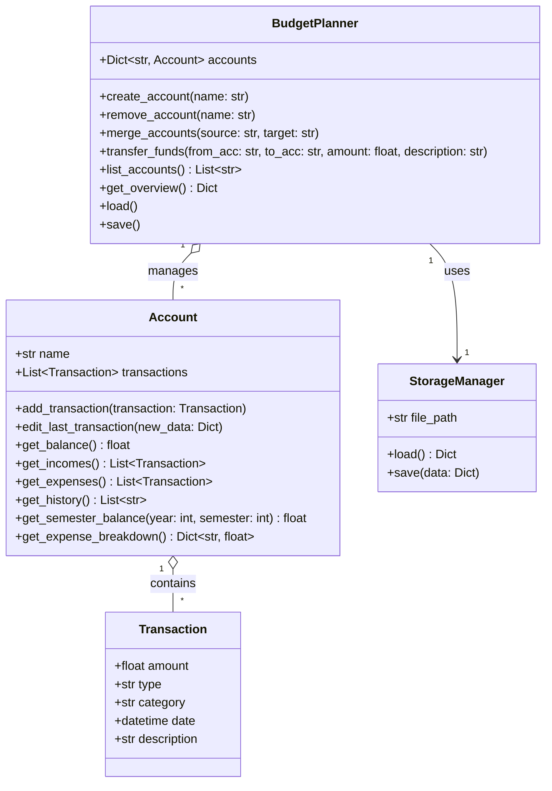

# Budget Planner
A personal finance management system designed to organize accounts, track transactions, visualize spending, and analyze financial habits — built using Python and Object-Oriented Programming (OOP).

## Features
1. Create, remove, and merge financial accounts
2. Add, edit, and classify transactions (income/expense)
3. Transfer funds between accounts
4. View account history and balances
5. Breakdown of expenses by category
6. Semester balance reports
7. Global overview of all accounts
8. Persistent storage using files
9. Clean OOP architecture for easy expansion

## OOP Architecture
UML Class Diagram (Mermaid)



## Folder Structure

```pgsql
budget_planner/
│
├── src/
│   ├── budget_planner.py
│   ├── account.py
│   ├── transaction.py
│   ├── storage_manager.py
│   └── main.py
│
├── data/
│   └── storage.json
│
├── docs/
│   ├── uml_class_diagram.md
|   └── roadmap.md
│
├── tests/
│   ├── test_account.py
│   ├── test_transactions.py
│   ├── test_planner.py
│   └── test_storage.py
│
└── README.md
```

## Installation

```bash
git clone https://github.com/yourusername/budget-planner
cd budget-planner
python3 main.py
```

## Usage
The system works through a simple menu-based interface:
1. Create accounts
2. Add transactions
3. View reports
4. Transfer funds
5. Remove/merge accounts
6. Save and load automatically

More interfaces (GUI, Web, REST API) can be added later thanks to the OOP structure.

## Roadmap
```markdown
## Roadmap
[x] Phase 1 – Core Classes & OOP Design
[ ] Phase 2 – CLI Interface
[ ] Phase 3 – Reporting & Analytics
[ ] Phase 4 – Persistence & Testing
[ ] Phase 5 – Optional Features
```

## License
MIT License.

You are free to use, modify, and distribute this project.
