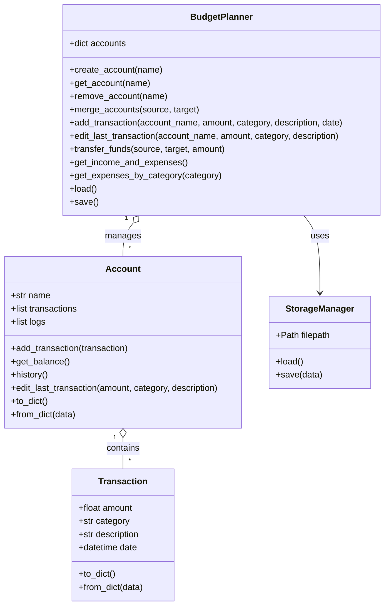

# Budget Planner

A command-line personal finance application built with Python and object-oriented programming.

The project manages financial accounts, transactions, transfers, and JSON persistence. It is also a learning project focused on developing Python and OOP skills through small, tested changes.

## Current Features

- Create and remove financial accounts
- Merge two different accounts
- Add and edit transactions
- Calculate account balances
- Transfer funds between accounts
- Calculate total income and expenses
- Filter expenses by category
- Record transaction edit logs
- Save and load account data using JSON
- Use an interactive command-line interface
- Verify core behavior with pytest

## OOP Architecture

The project separates responsibilities across four main classes:

- `Transaction` represents one financial transaction.
- `Account` manages transactions, balances, and edit logs.
- `BudgetPlanner` coordinates accounts and financial operations.
- `StorageManager` handles JSON persistence.


```mermaid
classDiagram
    class BudgetPlanner {
        +dict accounts
        +create_account(name)
        +get_account(name)
        +remove_account(name)
        +merge_accounts(source, target)
        +add_transaction(account_name, amount, category, description, date)
        +edit_last_transaction(account_name, amount, category, description)
        +transfer_funds(source, target, amount)
        +get_income_and_expenses()
        +get_expenses_by_category(category)
        +load()
        +save()
    }

    class Account {
        +str name
        +list transactions
        +list logs
        +add_transaction(transaction)
        +get_balance()
        +history()
        +edit_last_transaction(amount, category, description)
        +to_dict()
        +from_dict(data)
    }

    class Transaction {
        +float amount
        +str category
        +str description
        +datetime date
        +to_dict()
        +from_dict(data)
    }

    class StorageManager {
        +Path filepath
        +load()
        +save(data)
    }

    BudgetPlanner "1" o-- "*" Account : manages
    Account "1" o-- "*" Transaction : contains
    BudgetPlanner --> StorageManager : uses
```

## Project Structure

```text
budget_planner/
├── src/
│   ├── cli.py
│   ├── planner.py
│   ├── models/
│   │   ├── account.py
│   │   └── transaction.py
│   └── services/
│       └── storage_manager.py
├── data/
│   └── accounts.json          # Created when application data is saved
├── docs/
│   └── roadmap.md
├── tests/
│   ├── test_account.py
│   ├── test_budget_planner.py
│   ├── test_cli.py
│   └── test_transaction.py
├── pytest.ini
└── README.md
```

## Requirements

- Python 3.10 or newer
- pytest, for running the tests

The application itself uses only Python’s standard library.

## Installation

Clone the repository:

```bash
git clone https://github.com/CLMartello/budget_planner.git
cd budget_planner
```

Create and activate a virtual environment:

```bash
python3 -m venv .venv
source .venv/bin/activate
```

Install pytest:

```bash
python -m pip install -r requirements-dev.txt
```

## Usage

Start the command-line application:

```bash
python src/cli.py
```

The interactive menu provides account management, transaction management, transfers, summaries, and persistent storage.

## Tests

Run the complete test suite from the project root:

```bash
python -m pytest -q
```

Run one test file:

```bash
python -m pytest -q tests/test_transaction.py
```

## Roadmap

See [docs/roadmap.md](docs/roadmap.md) for completed work and planned features.

Possible future improvements include more financial reports, stronger input validation, CSV import/export, and a graphical or web interface.